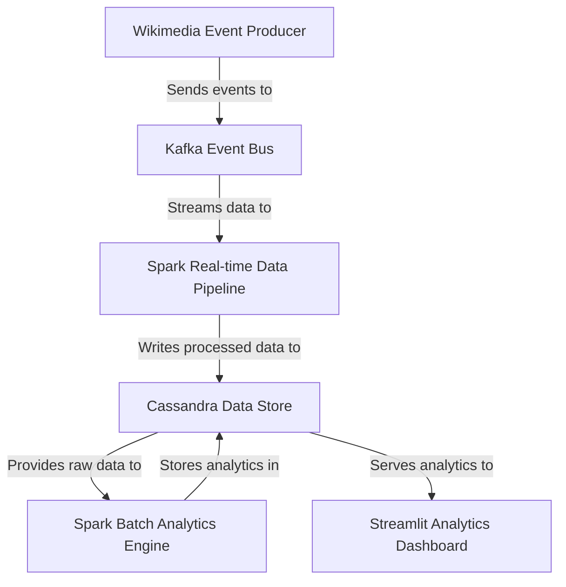

# Tutorial: BigData_WikipediaEditAnalysis

This project creates a *real-time analytics system* for Wikipedia edits. It **continuously captures** raw events as they happen, processes and structures them using a *high-performance data pipeline*, and stores them in a **scalable database**. It then performs *deep historical analysis* on this data to find trends and anomalies, all of which are displayed on an **interactive dashboard** for easy understanding.

## Visual Overview

## Chapters

1. [Streamlit Analytics Dashboard](readme_files/01_streamlit_analytics_dashboard_.md)
2. [Cassandra Data Store](readme_files/02_cassandra_data_store_.md)
3. [Spark Real-time Data Pipeline](readme_files/03_spark_real_time_data_pipeline_.md)
4. [Kafka Event Bus](readme_files/04_kafka_event_bus_.md)
5. [Wikimedia Event Producer](readme_files/05_wikimedia_event_producer_.md)
6. [Spark Batch Analytics Engine](readme_files/06_spark_batch_analytics_engine_.md)

---

