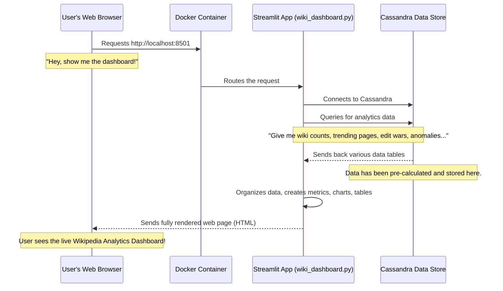

# Chapter 1: Streamlit Analytics Dashboard

Welcome to the first chapter of our exciting journey into analyzing Wikipedia edits! In this project, we'll be dealing with a lot of data – real-time edits happening on Wikipedia right now. But what's the point of collecting all this data if you can't easily understand what's going on?

Imagine you're driving a car. You don't want to see raw engine data or complicated electrical signals; you want a simple dashboard that shows you your speed, fuel level, and warning lights. Our **Streamlit Analytics Dashboard** is exactly like that for our Wikipedia analysis project!

## What Problem Does the Dashboard Solve?

Think about it: Millions of edits happen on Wikipedia every day. If you want to know:
*   Which Wikipedia pages are being edited the most right now?
*   Are there any "edit wars" (many users rapidly changing a page back and forth)?
*   Which users are most active?
*   Are there any unusual spikes in edits (anomalies)?

Trying to find answers in raw data (just lines of text or numbers) would be like searching for a needle in a haystack! It's difficult, time-consuming, and not very intuitive.

The Streamlit Analytics Dashboard solves this problem by giving us a beautiful, interactive "control panel" or "monitor screen." It takes all the complex analytical results we've calculated and displays them using easy-to-understand charts, graphs, and simple numbers. This way, you can see the "health" and activity of Wikipedia edits at a glance, just like your car's dashboard shows you its status.

## What is Streamlit?

At its heart, **Streamlit** is a fantastic Python library that helps data scientists and developers quickly create interactive web applications. You write simple Python code, and Streamlit magically turns it into a web page you can open in your browser. It’s perfect for building dashboards because it focuses on displaying data with minimal effort.

In our project, Streamlit acts as the friendly face of our data. It doesn't do the heavy data crunching itself. Instead, it connects to a special data storage system (which we'll learn about in the next chapter, the [Cassandra Data Store](02_cassandra_data_store_.md)) to fetch all the *already calculated* results. Then, it uses Python's charting libraries to draw impressive visualizations.

## How to Use the Streamlit Dashboard

Using the dashboard is surprisingly simple. Once our entire project is up and running (which involves several components working together), you just need to do two main things:

1.  **Start the project:** We use a tool called Docker Compose to launch all parts of our system with one command.
2.  **Open your web browser:** Navigate to a specific address, and *voila!* Your dashboard appears.

Let's look at the basic setup that makes this possible.

### 1. Setting Up the Environment

First, we need to tell our project what Python tools Streamlit needs to work. This is done in a simple file called `requirements.txt`.

```text
streamlit
pandas
altair
cassandra-driver
```

**Explanation:**
*   `streamlit`: This is the core library that builds our web dashboard.
*   `pandas`: A powerful library for working with data in tables, which is very useful for getting data ready for charts.
*   `altair`: A library specifically for creating beautiful and interactive charts.
*   `cassandra-driver`: This allows our Streamlit app to "talk" to the [Cassandra Data Store](02_cassandra_data_store_.md) and get data from it.

### 2. Building the Streamlit Application with Docker

To make sure everyone can run the dashboard the same way, we "package" it using something called Docker. A `Dockerfile` tells Docker how to build a mini-computer (a "container") that has everything our Streamlit app needs.

```dockerfile
FROM python:3.10
WORKDIR /app
COPY requirements.txt .
RUN pip install -r requirements.txt
COPY . .
EXPOSE 8501
CMD ["streamlit", "run", "wiki_dashboard.py", "--server.address=0.0.0.0"]
```

**Explanation:**
*   `FROM python:3.10`: Start with a base image that already has Python 3.10 installed.
*   `WORKDIR /app`: Set the main working directory inside our container to `/app`.
*   `COPY requirements.txt .`: Copy our list of Python tools into the container.
*   `RUN pip install -r requirements.txt`: Install all the necessary Python libraries.
*   `COPY . .`: Copy all the rest of our project's files (including `wiki_dashboard.py`) into the container.
*   `EXPOSE 8501`: Tell Docker that our app will be listening on port 8501.
*   `CMD ["streamlit", "run", "wiki_dashboard.py", ...]` This is the command that actually *starts* our Streamlit application when the container begins. It runs our `wiki_dashboard.py` file.

### 3. Launching the Dashboard with Docker Compose

Finally, to make it super easy to run the dashboard (and later, all other parts of our project), we use `docker-compose.yml`. This file tells Docker how to set up and run multiple containers together. For now, we only focus on the `streamlit` part.

```yaml
version: "3.8"

services:
  streamlit:
    build: .
    container_name: wiki_dashboard
    ports:
      - "8501:8501"
```

**Explanation:**
*   `services:`: Defines different parts of our project that will run as separate containers.
*   `streamlit:`: This is the name we give to our dashboard service.
*   `build: .`: Tells Docker Compose to look for the `Dockerfile` in the current directory (`.`) to build this service.
*   `container_name: wiki_dashboard`: Gives a friendly name to our running container.
*   `ports: - "8501:8501"`: This is crucial! It "maps" port 8501 inside our Docker container to port 8501 on your computer. This means you can open your web browser and go to `http://localhost:8501` to see the dashboard.

Once you have these files set up, you would simply open your terminal in the same folder and type:
```bash
docker-compose up
```
After a short while, your Streamlit Dashboard would be accessible in your web browser!

## What You'll See on the Dashboard

The `wiki_dashboard.py` file is where all the magic happens for displaying the data. Let's look at how it connects to data and shows basic information.

### Connecting to the Data Store

The first thing our Streamlit app does is reach out to the [Cassandra Data Store](02_cassandra_data_store_.md) to get the analytics.

```python
import streamlit as st
import pandas as pd
from cassandra.cluster import Cluster

# Set up the page layout
st.set_page_config(
    page_title="Wikipedia Analytics Dashboard",
    layout="wide"
)

# Connect to Cassandra
cluster = Cluster(["172.27.109.206"], port=9042) # IP address of Cassandra
session = cluster.connect("wiki") # 'wiki' is the database name

# Helper to fetch data
def fetch_table(table):
    rows = session.execute(f"SELECT * FROM {table} LIMIT 200")
    return pd.DataFrame(rows)

st.title("Wikipedia Live Analytics Dashboard")
```

**Explanation:**
*   `import streamlit as st`: Imports the Streamlit library. `st` is a common shortcut.
*   `from cassandra.cluster import Cluster`: Imports the tool to connect to Cassandra.
*   `cluster = Cluster(...)`: This line creates a connection point to our [Cassandra Data Store](02_cassandra_data_store_.md). You can see an IP address here, which is like the address of the specific computer where Cassandra is running.
*   `session = cluster.connect("wiki")`: Once connected to the cluster, we specify which "keyspace" (like a database) we want to work with, in this case, "wiki".
*   `def fetch_table(table)`: This is a small helper function to easily get data from any table in our Cassandra database and turn it into a `pandas` DataFrame (a table-like structure in Python).
*   `st.title(...)`: This simply puts a big, bold title at the top of our dashboard.

### Displaying Key Metrics

Once connected, the dashboard fetches important numbers and displays them prominently.

```python
# ... (previous connection code) ...

wiki_counts = fetch_table("analytics_wiki_counts") # Get data about wiki events
user_activity = fetch_table("analytics_user_activity") # Get data about active users

total_events = wiki_counts["event_count"].sum() if not wiki_counts.empty else 0
total_users = len(user_activity) # Count unique users

c1, c2, c3 = st.columns(3) # Create three columns for our metrics

c1.metric("Total Events", total_events) # Display "Total Events" in the first column
c2.metric("Active Users", total_users)  # Display "Active Users" in the second column
c3.metric("Wikis", len(wiki_counts))    # Display "Wikis" count in the third column

st.divider() # Draw a horizontal line for separation
```

**Explanation:**
*   `fetch_table(...)`: We use our helper function to grab data from specific tables in Cassandra. `analytics_wiki_counts` might contain how many edits each wiki (like `enwiki` or `dewiki`) has, and `analytics_user_activity` might list recent active users.
*   `total_events`, `total_users`: We calculate simple sums or counts from the fetched data.
*   `st.columns(3)`: Streamlit lets us arrange content in columns, which is great for a clean layout.
*   `c1.metric("Total Events", total_events)`: This is how Streamlit displays a big number with a label. It's perfect for key performance indicators (KPIs).

### Visualizing Data with Charts

A picture is worth a thousand words, especially when it comes to data! Our dashboard uses `altair` to create interactive charts.

```python
# ... (previous code) ...
import altair as alt # For creating charts

st.subheader("Events per Wiki") # A smaller heading for this section

if not wiki_counts.empty: # Check if we actually have data
    chart = alt.Chart(wiki_counts).mark_bar().encode(
        x="wiki",          # Use the 'wiki' column for the X-axis
        y="event_count"    # Use the 'event_count' column for the Y-axis
    )
    st.altair_chart(chart, use_container_width=True) # Display the chart
else:
    st.write("No data") # Show a message if no data
```

**Explanation:**
*   `st.subheader(...)`: Adds a smaller title for this section of the dashboard.
*   `alt.Chart(wiki_counts)`: Creates an Altair chart, using our `wiki_counts` data.
*   `.mark_bar()`: Tells Altair to draw a bar chart.
*   `.encode(x="wiki", y="event_count")`: This is how we specify which columns from our data should go on the X and Y axes of the chart. For example, we'll see a bar for each `wiki` (like "enwiki") and its height will show `event_count`.
*   `st.altair_chart(...)`: This command tells Streamlit to display the Altair chart we just created.

There are similar code blocks in `wiki_dashboard.py` for "Trending Pages", "Edit War Detection", and "Anomaly Detection," each fetching specific data from [Cassandra Data Store](02_cassandra_data_store_.md) and displaying it with different types of Altair charts or dataframes (`st.dataframe`).

## How the Dashboard Works Behind the Scenes

Let's quickly walk through what happens from the moment you open your browser to the moment you see the dashboard.



1.  **You open your browser:** You type `http://localhost:8501` and press Enter.
2.  **Docker catches the request:** Because we mapped port 8501, Docker (our container environment) sees this request and sends it to our running `streamlit` container.
3.  **Streamlit app starts:** Inside the container, the `wiki_dashboard.py` script is running. It initializes and sets up the page.
4.  **Connects to Cassandra:** The Python code in `wiki_dashboard.py` establishes a connection to our [Cassandra Data Store](02_cassandra_data_store_.md).
5.  **Fetches data:** The Streamlit app then sends several `SELECT * FROM ...` queries to Cassandra, asking for all the pre-calculated analytics data (like `analytics_wiki_counts`, `analytics_trending`, etc.).
6.  **Cassandra responds:** Cassandra sends the requested data back to the Streamlit app. This data is already processed and ready for display.
7.  **Streamlit builds the page:** Using `pandas` to handle the data and `altair` to draw charts, the Streamlit app dynamically builds the entire web page content (metrics, bar charts, scatter plots, data tables).
8.  **Dashboard appears in your browser:** Streamlit sends this generated web page back to your browser, and you see the interactive dashboard with all the insights!

## Conclusion

The Streamlit Analytics Dashboard is our user-friendly window into the vast world of Wikipedia edits. It takes complex, real-time data analysis results and transforms them into intuitive visual displays, making it easy for anyone to monitor activity, spot trends, and detect unusual patterns. It achieves this by connecting to our powerful [Cassandra Data Store](02_cassandra_data_store_.md) and using Python libraries like `pandas` and `altair` to present the data beautifully.

Now that we understand how we *view* the data, you might be wondering: How does all that precious, pre-calculated analytics data actually *get into* the [Cassandra Data Store](02_cassandra_data_store_.md) in the first place? That's what we'll explore in the next chapter!

[Next Chapter: Cassandra Data Store](02_cassandra_data_store_.md)

---

<sub><sup>**References**: [[1]](https://github.com/ISRajesh183/BigData_WikipediaEditAnalysis/blob/e2ede20441ea8af415eea2e95e9729fddc5403bc/Dockerfile), [[2]](https://github.com/ISRajesh183/BigData_WikipediaEditAnalysis/blob/e2ede20441ea8af415eea2e95e9729fddc5403bc/docker-compose.yml), [[3]](https://github.com/ISRajesh183/BigData_WikipediaEditAnalysis/blob/e2ede20441ea8af415eea2e95e9729fddc5403bc/requirements.txt), [[4]](https://github.com/ISRajesh183/BigData_WikipediaEditAnalysis/blob/e2ede20441ea8af415eea2e95e9729fddc5403bc/wiki_dashboard.py)</sup></sub>
