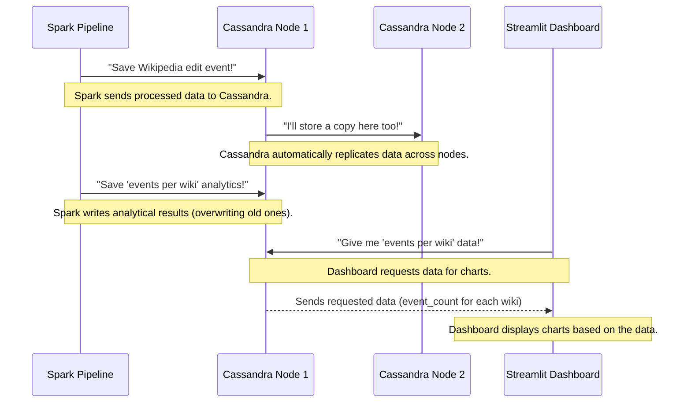

# Chapter 2: Cassandra Data Store

Welcome back, future data wizard! In our last chapter, we explored the [Streamlit Analytics Dashboard](01_streamlit_analytics_dashboard_.md) – the friendly face of our Wikipedia edit analysis project. We saw how it takes complex data and presents it beautifully with charts and numbers. But remember how the dashboard connected to a "special data storage system" to fetch all those *already calculated* results?

That "special data storage system" is exactly what we're diving into now: the **Cassandra Data Store**!

## What Problem Does Cassandra Solve?

Imagine you're running a massive online library, much bigger than any physical library you've ever seen. This library gets millions of new books (data) every single day, and thousands of people are constantly looking up information (reading data) at the same time.

Now, imagine this library needs to:
1.  **Store everything:** From the raw, messy notes to the perfectly cataloged, summarized reports.
2.  **Be super fast:** No one wants to wait for a book, especially when there are millions of books to choose from.
3.  **Never go offline:** If one shelf collapses or one librarian takes a break, the whole library shouldn't shut down. Books should still be accessible!
4.  **Grow easily:** If you need more space or more librarians, you should be able to add them without rebuilding the entire library.

A traditional database (like a single, giant filing cabinet) would quickly struggle with such demands. It would get slow, become a single point of failure, and be incredibly difficult to expand.

The **Cassandra Data Store** solves this exact problem for our Wikipedia project. It's designed to be that "massive, distributed library" where all our Wikipedia event data (raw and processed) and analytical results are stored. It ensures that different parts of our system – like the dashboard wanting to *read* data, or the real-time pipelines wanting to *write* data – can do so quickly and reliably, without causing bottlenecks. It's the persistent memory of our entire system.

## What is Cassandra? Key Concepts for Beginners

Cassandra is like a super-powered, globally distributed filing cabinet. Let's break down its key features in simple terms:

### 1. It's "Distributed" (Spread Out)

Imagine our library isn't just one big building, but many smaller library branches spread across different locations. Each branch holds a part of the collection, and they all work together.

*   **In Cassandra:** Data isn't stored on a single computer. Instead, it's spread across many computers (called "nodes"). This makes it incredibly powerful.

### 2. "High Availability" (Always Open)

If one library branch closes for maintenance, you can still find the book you need at another branch.

*   **In Cassandra:** If one computer (node) in the cluster goes down, your data is still available because copies exist on other nodes. This means our dashboard won't suddenly stop working if one server has an issue.

### 3. "Scalable" (Easy to Grow)

If the library needs more space or more librarians, you just open a new branch and connect it to the network.

*   **In Cassandra:** If we need to store more data or handle more users, we can simply add more computers (nodes) to our Cassandra cluster. It automatically starts using them and spreads the data out, making it easy to grow as our Wikipedia data grows.

### 4. "NoSQL" (Flexible Storage)

Traditional databases are like a strict spreadsheet: every row must have the same number of columns, and you define everything upfront. Cassandra is a "NoSQL" database, meaning "not only SQL." It's more flexible, especially for vast amounts of data that might not fit neatly into rigid tables. While it still uses rows and columns, it's optimized differently for speed and scale.

### Cassandra's Structure: Keyspaces and Tables

To organize our data, Cassandra uses a simple two-tier structure:

| Concept   | Analogy                                   | Explanation                                                                                                                                                                                                            |
| :-------- | :---------------------------------------- | :--------------------------------------------------------------------------------------------------------------------------------------------------------------------------------------------------------------------- |
| **Keyspace** | A specific section of our giant library | Think of it like a database. In our project, we have a keyspace named `wiki` where all Wikipedia-related data and analytics are stored. It's a container for tables.                                                    |
| **Table** | A filing cabinet within that section    | Inside a keyspace, data is stored in tables, much like in a spreadsheet. Each table has columns (like `title`, `user`, `event_count`) and rows (individual data entries).                                              |
| **Primary Key** | The unique ID on a book's spine     | Every table needs a "Primary Key." This is one or more columns that uniquely identify each row. It's super important because Cassandra uses this key to find your data incredibly fast, no matter how much data you have! |

## How Our Project Uses Cassandra

Cassandra acts as the central hub for all our project's data.

*   **Writing Data In:** Our [Spark Real-time Data Pipeline](03_spark_real_time_data_pipeline_.md) (which we'll cover in the next chapter) constantly processes incoming Wikipedia edits and writes both the raw data and processed events into various Cassandra tables. Our [Spark Batch Analytics Engine](06_spark_batch_analytics_engine_.md) also writes its calculated results (like trending pages or edit war detections) to Cassandra.
*   **Reading Data Out:** Our [Streamlit Analytics Dashboard](01_streamlit_analytics_dashboard_.md) connects to Cassandra to quickly fetch all these stored results and display them.

Let's look at some simplified examples of how this happens.

### 1. Setting Up Cassandra: Creating Keyspaces and Tables

Before we can store data, we need to create our `wiki` keyspace and the tables within it. We can do this using a command-line tool called `cqlsh` (Cassandra Query Language Shell), which is like typing commands directly to Cassandra.

First, create the `wiki` keyspace:

```cql
CREATE KEYSPACE wiki WITH replication = {'class': 'SimpleStrategy', 'replication_factor': 1};
```

**Explanation:**
*   `CREATE KEYSPACE wiki`: We're telling Cassandra to make a new "database" named `wiki`.
*   `WITH replication = {'class': 'SimpleStrategy', 'replication_factor': 1}`: This is a bit technical, but it tells Cassandra how to copy our data for safety. `SimpleStrategy` is for single-data-center setups (like our project), and `replication_factor: 1` means there's 1 copy of the data. For a real production system, you'd have more copies and more advanced strategies!

Next, we create a table, for example, `analytics_wiki_counts`, which stores how many edits each Wikipedia language (`wiki`) has received.

```cql
CREATE TABLE wiki.analytics_wiki_counts (
    wiki TEXT PRIMARY KEY,
    event_count INT
);
```

**Explanation:**
*   `CREATE TABLE wiki.analytics_wiki_counts`: We're creating a table named `analytics_wiki_counts` inside our `wiki` keyspace.
*   `wiki TEXT PRIMARY KEY`: This defines a column named `wiki` that will store text (like "enwiki", "dewiki"). It's also our `PRIMARY KEY`, meaning each `wiki` value must be unique, and Cassandra will use this to find data super fast.
*   `event_count INT`: This defines another column named `event_count` that will store whole numbers (integers).

### 2. Writing Data to Cassandra (from Spark)

Our Spark pipelines are responsible for processing Wikipedia events and saving them into Cassandra. Here's a highly simplified example from a Spark script (like `raw_filter.py` or `wiki_analytics.py`) showing how processed data gets written:

```python
# Imagine 'base_df' is a Spark DataFrame with processed Wikipedia edits
# It has columns like 'event_time', 'id', 'type', 'title', 'user', 'wiki', 'bot'

base_df.writeStream \
    .format("org.apache.spark.sql.cassandra") \
    .option("keyspace", "wiki") \
    .option("table", "events_base") \
    .outputMode("append") \
    .start()
```

**Explanation:**
*   `base_df.writeStream`: We're using Spark's ability to write streaming data.
*   `.format("org.apache.spark.sql.cassandra")`: This tells Spark to use its connector for Cassandra.
*   `.option("keyspace", "wiki")`: Specifies that we want to write to our `wiki` keyspace.
*   `.option("table", "events_base")`: Specifies the name of the table (`events_base`) where this data should go.
*   `.outputMode("append")`: Means we're adding new rows to the table.
*   `.start()`: Kicks off the continuous writing process.

Similarly, our analytics engine will write its results, for instance, the `wiki_counts` data we discussed earlier:

```python
# 'wiki_counts' is a Spark DataFrame containing the count of events per wiki.
# It has columns like 'wiki' and 'event_count'.

wiki_counts.write \
    .format("org.apache.spark.sql.cassandra") \
    .option("keyspace", "wiki") \
    .option("table", "analytics_wiki_counts") \
    .mode("overwrite") \
    .save()
```

**Explanation:**
*   `wiki_counts.write`: We're writing the *calculated* `wiki_counts` data.
*   `.mode("overwrite")`: This is important! For analytics that are regularly re-calculated (like total counts), we might overwrite the previous results instead of just appending.

### 3. Reading Data from Cassandra (for the Dashboard)

As we saw in Chapter 1, our [Streamlit Analytics Dashboard](01_streamlit_analytics_dashboard_.md) connects to Cassandra to grab the analytical results.

```python
from cassandra.cluster import Cluster

# Connect to the Cassandra server (our "library")
# The IP address '172.27.109.206' is where our Cassandra container runs.
cluster = Cluster(["172.27.109.206"], port=9042)

# Connect to the 'wiki' keyspace (our specific section of the library)
session = cluster.connect("wiki")

# Fetch data from a table, e.g., 'analytics_wiki_counts'
rows = session.execute("SELECT * FROM analytics_wiki_counts LIMIT 200")

# The 'rows' variable now holds the data that can be used to build a chart!
```

**Explanation:**
*   `cluster = Cluster(...)`: This line establishes a connection to the Cassandra database server. Think of it as opening the door to our distributed library.
*   `session = cluster.connect("wiki")`: Once connected to the server, we specify which `keyspace` (our specific `wiki` section) we want to work with.
*   `session.execute(...)`: This is how we ask Cassandra for data, using a `SELECT` query. Here, we're asking for all columns (`*`) from the `analytics_wiki_counts` table, limiting to 200 rows for display. Cassandra quickly finds and returns the data because of its efficient design and primary keys.

## How Cassandra Works Behind the Scenes

Let's put it all together to see the journey of data through Cassandra in our project.



1.  **Spark Processes and Writes:** Our [Spark Real-time Data Pipeline](03_spark_real_time_data_pipeline_.md) continuously processes incoming Wikipedia edits. As it filters and transforms this data, it sends different versions (raw, base events, edit events, log events) to Cassandra. The [Spark Batch Analytics Engine](06_spark_batch_analytics_engine_.md) also runs periodically to calculate things like `events_per_wiki` or `trending_pages` and writes these *results* back into Cassandra.
2.  **Cassandra Stores and Distributes:** When Cassandra receives data, it doesn't just put it on one computer. It intelligently distributes chunks of that data across various nodes in the cluster. It also ensures that copies (replicas) of the data exist on other nodes, so if one node fails, the data is not lost and remains available.
3.  **Dashboard Requests:** When you open your [Streamlit Analytics Dashboard](01_streamlit_analytics_dashboard_.md), it sends requests to Cassandra for specific data. For example, it asks for the `analytics_wiki_counts` table.
4.  **Cassandra Retrieves and Returns:** Cassandra, using its super-fast primary key lookups, quickly finds the requested data, even across many nodes. It then sends this data back to the Streamlit dashboard.
5.  **Dashboard Visualizes:** The dashboard receives the data and uses it to draw the interactive charts and metrics you see, giving you real-time insights into Wikipedia edits!

### Where in the Code?

Let's quickly point to where Cassandra is used in the provided code snippets:

**1. Writing Raw and Filtered Events (from `raw_filter.py`)**

This script, part of our real-time pipeline, continuously reads raw Wikipedia events, cleans them, and then streams them into several Cassandra tables.

```python
# From raw_filter.py (simplified)

# ... (Spark processing to create 'base_df') ...

# Writing base events to Cassandra
base_query = base_df.writeStream \
    .format("org.apache.spark.sql.cassandra") \
    .option("keyspace", "wiki") \
    .option("table", "events_base") \
    .option("checkpointLocation", "file:///tmp/checkpoint_base") \
    .outputMode("append") \
    .start()

# ... (similar code for events_edit, events_log, events_new, raw_events) ...
```

**Explanation:** This part shows how our real-time Spark pipeline uses the `writeStream` command to continuously push cleaned and categorized Wikipedia event data into Cassandra tables like `events_base`. Each table stores a slightly different view of the event, optimized for specific analyses.

**2. Writing Analytical Results (from `wiki_analytics.py`)**

This script calculates various analytics (like wiki counts, trending pages) and then writes those results to Cassandra.

```python
# From wiki_analytics.py (simplified)

# ... (Spark computations to create 'wiki_counts' DataFrame) ...

# Writing the calculated wiki_counts to Cassandra
wiki_counts.write \
    .format("org.apache.spark.sql.cassandra") \
    .options(table="analytics_wiki_counts", keyspace="wiki") \
    .mode("overwrite") \
    .save()

# ... (similar code for analytics_user_activity, analytics_suspicious_edits, etc.) ...
```

**Explanation:** After performing calculations (like counting events per wiki), this snippet shows how Spark uses `df.write` to save these aggregated results into specific Cassandra tables, which are then ready for the dashboard to read. `mode("overwrite")` ensures that each time the analytics are run, the old results are replaced with the new ones.

**3. Reading Data for the Dashboard (from `wiki_dashboard.py`)**

This is the code we saw in Chapter 1, showing how the Streamlit dashboard connects to Cassandra to get data for display.

```python
# From wiki_dashboard.py (simplified)
import streamlit as st
import pandas as pd
from cassandra.cluster import Cluster

# Connect to Cassandra
cluster = Cluster(["172.27.109.206"], port=9042)
session = cluster.connect("wiki") # 'wiki' is our keyspace

# Helper to fetch data
def fetch_table(table):
    # Execute a CQL query to get data from a specific table
    rows = session.execute(f"SELECT * FROM {table} LIMIT 200")
    return pd.DataFrame(rows) # Convert Cassandra rows into a Pandas table

# ... (later, in the dashboard logic) ...
wiki_counts = fetch_table("analytics_wiki_counts") # Get data about wiki events
```

**Explanation:** The dashboard uses the `cassandra-driver` Python library to connect to Cassandra, select the `wiki` keyspace, and then run `SELECT` queries to retrieve the pre-calculated analytics data from tables like `analytics_wiki_counts`. This data is then used to populate the metrics and charts on the dashboard.

## Why Cassandra is Great for Big Data Projects

| Feature             | Benefit for `BigData_WikipediaEditAnalysis`                                                                  |
| :------------------ | :----------------------------------------------------------------------------------------------------------- |
| **Massive Scalability** | Can easily handle the huge volume of Wikipedia edits and grow with more data or users simply by adding more computers (nodes). |
| **High Availability**   | If one part of our system (a Cassandra node) fails, our data is still safe and accessible, meaning our dashboard keeps running. |
| **Fast Reads/Writes**   | Allows our Spark pipelines to write data quickly and our dashboard to retrieve data swiftly, without slowdowns. |
| **Flexible Schema**     | Adapts well to evolving data structures from Wikipedia events.                                                |
| **Durability**          | Our valuable Wikipedia event data and analytical results are stored reliably and persist even if services restart. |

## Conclusion

The Cassandra Data Store is the backbone of our `BigData_WikipediaEditAnalysis` project. It's our intelligent, massive, and always-available library that stores every piece of raw, processed, and analyzed Wikipedia event data. It empowers our [Streamlit Analytics Dashboard](01_streamlit_analytics_dashboard_.md) by providing quick access to insights and ensures our entire system can scale to handle the continuous flow of Wikipedia edits.

Now that we understand where our data *lives*, the next logical question is: How does all that raw Wikipedia event data actually *get into* our system so that Spark can process it and save it to Cassandra? That's exactly what we'll explore in the next chapter!

[Next Chapter: Spark Real-time Data Pipeline](03_spark_real_time_data_pipeline_.md)

---

<sub><sup>**References**: [[1]](https://github.com/ISRajesh183/BigData_WikipediaEditAnalysis/blob/e2ede20441ea8af415eea2e95e9729fddc5403bc/raw_filter.py), [[2]](https://github.com/ISRajesh183/BigData_WikipediaEditAnalysis/blob/e2ede20441ea8af415eea2e95e9729fddc5403bc/wiki_analytics.py), [[3]](https://github.com/ISRajesh183/BigData_WikipediaEditAnalysis/blob/e2ede20441ea8af415eea2e95e9729fddc5403bc/wiki_dashboard.py)</sup></sub>
