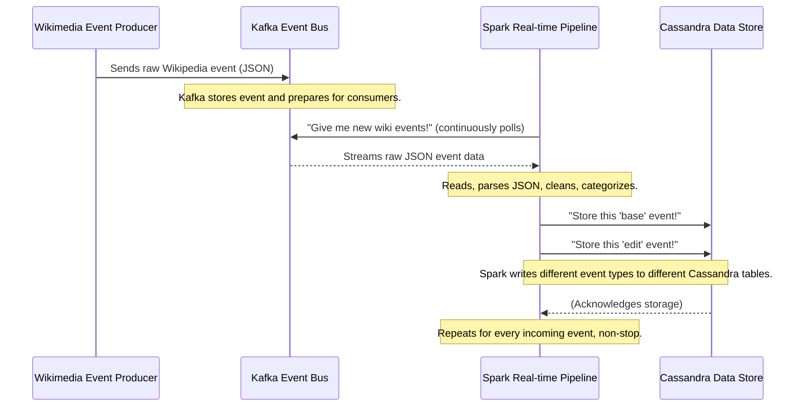

# Chapter 3: Spark Real-time Data Pipeline

Welcome back, data adventurers! In our previous chapter, we uncovered the secrets of the [Cassandra Data Store](02_cassandra_data_store_.md), learning how it acts as our project's super-fast, always-on memory, storing all our raw Wikipedia events and analytical results. Before that, we saw how the [Streamlit Analytics Dashboard](01_streamlit_analytics_dashboard_.md) beautifully displays these results.

But a crucial question remains: How does all that messy, raw Wikipedia event data actually *get* into our system, get *cleaned up*, and then *organized* into Cassandra so our dashboard can eventually use it?

This is where the **Spark Real-time Data Pipeline** comes in!

## What Problem Does the Spark Real-time Data Pipeline Solve?

Imagine a busy factory where raw materials (like Wikipedia edits happening every second) arrive non-stop, in all shapes and sizes. These materials are complex, sometimes jumbled, and not yet ready for building anything useful.

If you just piled them up, you'd have a giant, unusable mess! What you need is an "assembly line" that continuously:
1.  **Receives** the raw materials.
2.  **Sorts** them.
3.  **Cleans** them up.
4.  **Transforms** them into standardized parts.
5.  **Delivers** these parts to different storage bins (Cassandra tables) for later use.

The **Spark Real-time Data Pipeline** is exactly this assembly line for our Wikipedia project. It takes the continuous stream of raw, complex Wikipedia events (like a new page being created, an existing page being edited, or a user being blocked), processes them in "real-time" (as they happen), and then neatly organizes them into our [Cassandra Data Store](02_cassandra_data_store_.md). Without this pipeline, our system would be flooded with unmanageable data, and our dashboard would have nothing clean to display!

## What is Spark and "Real-time" Data?

Before we dive deeper, let's quickly understand the core tools:

### 1. What is Spark?

**Apache Spark** is like a super-powerful, super-fast "data processing factory." It's great at handling huge amounts of data, whether that data is sitting still (like files on a disk) or constantly flowing (like our Wikipedia edits). It can run on many computers at once, making it incredibly efficient for big data tasks.

### 2. What does "Real-time" mean here?

In the world of data, "real-time" means processing data *as it arrives*, or very soon after. Think of it like a live news report: you get the information almost instantly, as it unfolds. Our Spark pipeline aims to process Wikipedia events within seconds of them happening, rather than waiting for hours to process a day's worth of data.

## Key Steps of Our Data Pipeline "Assembly Line"

Our Spark Real-time Data Pipeline is implemented using a Python script called `raw_filter.py`. Let's break down its main "assembly stations":

### Station 1: Receiving Raw Events from Kafka

Our pipeline continuously listens to the [Kafka Event Bus](04_kafka_event_bus_.md), which is like a high-speed conveyor belt that brings in all the raw Wikipedia events.

```python
# raw_filter.py (simplified)
from pyspark.sql import SparkSession

# 1. Start our Spark data processing engine
spark = SparkSession.builder.appName("WikiPipeline").getOrCreate()

# 2. Tell Spark to read incoming messages from Kafka
df = spark.readStream \
    .format("kafka") \
    .option("kafka.bootstrap.servers", "localhost:9092") \
    .option("subscribe", "wiki_edits") \
    .option("startingOffsets", "latest") \
    .load()

# 3. Extract the actual event message and its timestamp
raw_df = df.selectExpr(
    "CAST(value AS STRING) as raw_json",
    "timestamp as event_time",
    "offset as kafka_id"
)
```

**Explanation:**
*   `SparkSession.builder...`: This line starts our Spark engine, ready to do work.
*   `spark.readStream...load()`: This is the crucial part that tells Spark, "Hey, I want you to connect to the [Kafka Event Bus](04_kafka_event_bus_.md) (running on `localhost:9092`) and continuously listen for new messages on a specific 'topic' called `wiki_edits`."
*   `raw_df = df.selectExpr(...)`: Kafka sends us raw bytes. We convert the main content (`value`) into a readable string (`raw_json`), and also grab the `timestamp` when Kafka received it, and a unique `id` from Kafka.

### Station 2: Understanding the Raw JSON (Defining the Schema)

The raw Wikipedia events arrive as complex JSON text. Before Spark can work with it, we need to give it a "blueprint" of how the JSON is structured. This blueprint is called a **schema**.

```python
# raw_filter.py (simplified)
from pyspark.sql.types import *

# This is our blueprint for the complex JSON Wikipedia event
schema = StructType([
    StructField("meta", StructType([
        StructField("id", StringType()), # Unique ID for the event
        # ... other meta fields ...
    ])),
    StructField("id", LongType()),      # A different event ID (confusing, we'll fix!)
    StructField("type", StringType()),  # What kind of event (e.g., "edit", "log")
    StructField("title", StringType()), # Page title
    StructField("user", StringType()),  # User who made the edit/action
    StructField("wiki", StringType()),  # Which Wikipedia (e.g., "enwiki", "dewiki")
    StructField("bot", BooleanType()),  # Was it a bot?
    StructField("length", StructType([  # Length of content before/after edit
        StructField("old", IntegerType()),
        StructField("new", IntegerType())
    ])),
    # ... other fields like revision, log_type, log_action ...
])
```

**Explanation:**
*   `StructType([...])`: This is how we define the expected structure of our JSON. It's like saying, "I expect a field called `type` which is text, a field called `user` which is text, and a field called `length` which itself contains two numbers (`old` and `new`)."
*   We define this upfront so Spark knows how to pick apart the incoming JSON efficiently.

### Station 3: Parsing and Cleaning the JSON

Now, Spark uses the `schema` blueprint to actually read the `raw_json` and turn it into structured columns. We also do some initial cleaning, like renaming a confusing `id` field.

```python
# raw_filter.py (simplified)
from pyspark.sql.functions import from_json, col

# Use our schema to parse the raw JSON string
json_df = raw_df.select(
    from_json(col("raw_json"), schema).alias("data"),
    col("event_time"),
    col("kafka_id"),
    col("raw_json")
)

# Extract specific fields and rename for clarity
parsed_df = json_df.select(
    col("data.id").alias("event_id"),  # This is the Wikipedia-specific event ID
    col("data.type"),
    col("data.title"),
    col("data.user"),
    col("data.wiki"),
    col("data.bot"),
    col("data.length"), # Keeps the nested structure for now
    col("event_time"),
    col("kafka_id").alias("id"),       # THIS is OUR unique primary key for Cassandra
    col("raw_json")
)

parsed_df.printSchema() # This will show you the new, clean structure!
```

**Explanation:**
*   `from_json(col("raw_json"), schema)`: This is the magic! Spark takes the raw JSON text from `raw_json` column and applies our `schema` to it, creating a new `data` column that's structured and easy to work with.
*   `col("data.id").alias("event_id")`: We select specific fields from the `data` column (e.g., `data.id`) and give them friendlier names (e.g., `event_id`).
*   `col("kafka_id").alias("id")`: We take the unique ID from Kafka and use it as our main `id` column. This `id` will be the Primary Key when we store data in [Cassandra Data Store](02_cassandra_data_store_.md).

### Station 4: Categorizing Events into Different "Bins"

Not all Wikipedia events are the same! Our pipeline then filters the `parsed_df` into different categories, so we can store them in different tables in [Cassandra Data Store](02_cassandra_data_store_.md) and analyze them separately.

```python
# raw_filter.py (simplified)
# Base events (common fields for all events)
base_df = parsed_df.select(
    "event_time", "id", "type", "title", "user", "wiki", "bot"
)

# Edit events (only events where type is "edit")
edit_df = parsed_df.filter(col("type") == "edit").select(
    "title", "event_time", "user", "wiki",
    col("length.old").alias("old_length"), # Extract nested length info
    col("length.new").alias("new_length")
    # ... and revision info ...
)

# Log events (only events where type is "log")
log_df = parsed_df.filter(col("type") == "log").select(
    "title", "event_time", "user", "wiki",
    "log_type", "log_action"
)

# New Page events (only events where type is "new")
new_df = parsed_df.filter(col("type") == "new").select(
    "title", "event_time", "user", "wiki",
    col("length.new").alias("length")
)
```

**Explanation:**
*   `base_df`: This DataFrame contains general information common to all event types.
*   `parsed_df.filter(col("type") == "edit")`: This line creates a new DataFrame (`edit_df`) that *only* contains rows where the `type` column is "edit". This is like saying, "From all the events, just show me the ones that are actual edits."
*   `col("length.old").alias("old_length")`: For edit events, we "flatten" the nested `length` structure into separate `old_length` and `new_length` columns, making it easier to analyze later.
*   Similar filters are applied for `log` events (like user blocks or page deletions) and `new` page creations.

### Station 5: Continuously Storing to Cassandra

Finally, the pipeline continuously writes each of these categorized DataFrames into their respective tables in our [Cassandra Data Store](02_cassandra_data_store_.md).

```python
# raw_filter.py (simplified)

# Write base events to the 'events_base' table in Cassandra
base_query = base_df.writeStream \
    .format("org.apache.spark.sql.cassandra") \
    .option("keyspace", "wiki") \
    .option("table", "events_base") \
    .option("checkpointLocation", "file:///tmp/checkpoint_base") \
    .outputMode("append") \
    .start()

# Write edit events to the 'events_edit' table
edit_query = edit_df.writeStream \
    .option("keyspace", "wiki") \
    .option("table", "events_edit") \
    .option("checkpointLocation", "file:///tmp/checkpoint_edit") \
    .outputMode("append") \
    .start()

# And similarly for log_df, new_df, and even a raw_events table.
# ... (log_query, new_query, raw_query) ...

# Keep the Spark streams running indefinitely
spark.streams.awaitAnyTermination()
```

**Explanation:**
*   `df.writeStream`: This tells Spark to continuously take new data coming into this DataFrame (`base_df`, `edit_df`, etc.) and write it out.
*   `.format("org.apache.spark.sql.cassandra")`: This specifies that we're writing to a Cassandra database.
*   `.option("keyspace", "wiki")` and `.option("table", "events_base")`: These tell Spark *where* in Cassandra to put the data – into the `wiki` keyspace and the `events_base` table (or `events_edit`, `events_log`, `events_new`).
*   `.option("checkpointLocation", "file:///tmp/checkpoint_base")`: This is super important for real-time streams! It tells Spark to periodically save its progress. If the pipeline ever stops and restarts, it knows exactly where it left off and won't miss any data or process duplicates.
*   `.outputMode("append")`: Means we're always adding new rows to the Cassandra tables.
*   `.start()`: Kicks off this continuous writing process.
*   `spark.streams.awaitAnyTermination()`: This command keeps our Spark application running forever, continuously processing and storing data.

## How the Spark Pipeline Works Behind the Scenes

Let's visualize this continuous assembly line process:



1.  **Events Enter Kafka:** New Wikipedia events, in their raw JSON form, are constantly generated by the [Wikimedia Event Producer](05_wikimedia_event_producer_.md) and sent to the [Kafka Event Bus](04_kafka_event_bus_.md).
2.  **Spark Listens:** Our `raw_filter.py` script (running as a Spark application) continuously connects to Kafka and "subscribes" to the `wiki_edits` topic, eagerly waiting for new events.
3.  **Spark Processes:** As soon as Spark receives a new raw JSON event from Kafka, it quickly:
    *   Parses the JSON using its schema.
    *   Extracts relevant fields.
    *   Renames fields for clarity.
    *   Decides what *type* of event it is (edit, log, new, or just a base event).
    *   Creates a clean, structured record for each relevant category.
4.  **Spark Writes to Cassandra:** For each structured event, Spark then continuously writes it into the appropriate table within our `wiki` keyspace in the [Cassandra Data Store](02_cassandra_data_store_.md) (e.g., base events go to `events_base`, edit events go to `events_edit`, etc.). It also saves its checkpoint to ensure no data loss.
5.  **Continuous Loop:** This entire process happens over and over, 24/7, for every single Wikipedia event that comes in. The Spark pipeline is like the diligent factory worker, tirelessly cleaning and organizing data as it flows through the system.

## Why the Spark Real-time Data Pipeline is Essential

| Feature                | Benefit for `BigData_WikipediaEditAnalysis`                                                                                                                                                                          |
| :--------------------- | :------------------------------------------------------------------------------------------------------------------------------------------------------------------------------------------------------------------- |
| **Real-time Processing** | Provides immediate insights into Wikipedia activity. We don't have to wait hours; changes are reflected on the dashboard very quickly.                                                                                 |
| **Data Cleaning**      | Turns messy, complex raw JSON into clean, structured tables, making it usable for analysis.                                                                                                                            |
| **Categorization**     | Organizes different types of events (edits, logs, new pages) into separate tables, which simplifies later analysis and querying.                                                                                       |
| **Scalability**        | Spark can easily handle the massive volume of Wikipedia events. If the event stream gets bigger, we can add more computing power to Spark, and it will automatically scale up.                                            |
| **Fault Tolerance**    | With `checkpointLocation`, if something goes wrong and the pipeline crashes, it can restart and pick up exactly where it left off, ensuring no data is lost or duplicated.                                                |
| **Integration**        | Seamlessly connects the [Kafka Event Bus](04_kafka_event_bus_.md) (source of raw data) with the [Cassandra Data Store](02_cassandra_data_store_.md) (destination for structured data).                                  |

## Conclusion

The Spark Real-time Data Pipeline is the beating heart of our Wikipedia analysis project. It's the tireless assembly line that continuously takes raw, messy Wikipedia event data from the [Kafka Event Bus](04_kafka_event_bus_.md), transforms it into clean, structured information, categorizes it, and then streams it into various tables in our [Cassandra Data Store](02_cassandra_data_store_.md). This continuous processing is what makes real-time analytics possible, feeding our [Streamlit Analytics Dashboard](01_streamlit_analytics_dashboard_.md) with fresh, organized insights.

Now that we know how Spark processes the data, you might be asking: Where do these raw Wikipedia events come from, and how do they actually *enter* our system's "conveyor belt" ([Kafka Event Bus](04_kafka_event_bus_.md)) in the first place? That's what we'll uncover in the very next chapter!

[Next Chapter: Kafka Event Bus](04_kafka_event_bus_.md)

---

<sub><sup>**References**: [[1]](https://github.com/ISRajesh183/BigData_WikipediaEditAnalysis/blob/e2ede20441ea8af415eea2e95e9729fddc5403bc/raw_filter.py)</sup></sub>
