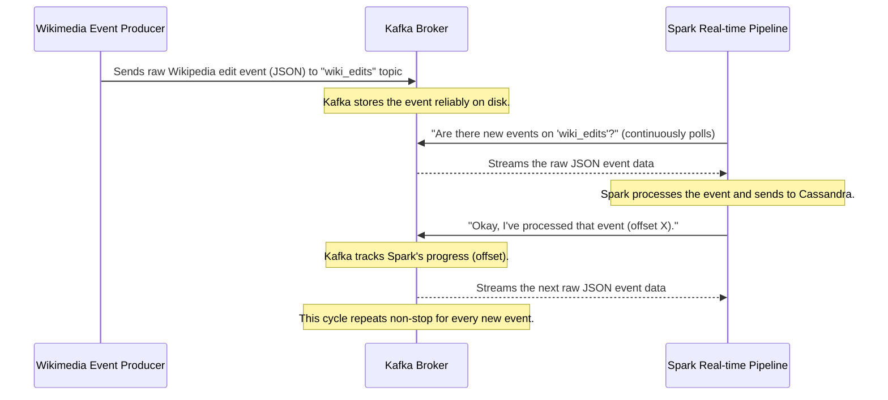

# Chapter 4: Kafka Event Bus

Welcome back, data explorers! In our last chapter, we delved into the powerful [Spark Real-time Data Pipeline](03_spark_real_time_data_pipeline_.md), the assembly line that continuously processes raw Wikipedia events and stores them in our [Cassandra Data Store](02_cassandra_data_store_.md). But imagine an assembly line without a reliable way to get its raw materials. How do all those continuous, real-time Wikipedia edits actually *arrive* at Spark's doorstep?

This is where the **Kafka Event Bus** comes into play – it's the high-speed, super-reliable central nervous system that carries all our Wikipedia event data around the project!

## What Problem Does the Kafka Event Bus Solve?

Think of our project like a bustling city. Various places are generating important messages:
*   The **Wikimedia Event Producer** (our next chapter!) is like a news reporter, constantly observing Wikipedia for new edits and broadcasting them.
*   The [Spark Real-time Data Pipeline](03_spark_real_time_data_pipeline_.md) is like a news agency, always waiting to receive and process these news flashes.
*   Other applications might want to listen to these events too, perhaps for security monitoring or archiving.

If the reporter just yelled out news, some might miss it. If the news agency could only listen to one reporter at a time, it would be overwhelmed. What we need is a central, robust "postal service" or "data highway" that can:
1.  **Receive** all messages reliably, no matter how many there are.
2.  **Store** messages temporarily, just in case the news agency is busy or offline.
3.  **Deliver** messages to *any* interested listener, without the sender needing to know who or where they are.
4.  **Handle huge volumes** of messages without slowing down.

The **Kafka Event Bus** solves this problem by acting as this central, highly efficient "postal service" for all our Wikipedia edit events. Once the [Wikimedia Event Producer](05_wikimedia_event_producer_.md) captures an event, it sends it here. Kafka reliably stores these messages in specific categories (like "wiki_edits") and delivers them to any interested application, such as our [Spark Real-time Data Pipeline](03_spark_real_time_data_pipeline_.md), ensuring data can be processed asynchronously and at scale. It acts as a buffer and a high-throughput communication backbone.

## What is Kafka? Key Concepts for Beginners

Kafka is a powerful, distributed "streaming platform." Let's break down its key concepts with a postal service analogy:

| Kafka Concept  | Postal Service Analogy                                       | Explanation                                                                                                                                                                                                                                                                      |
| :------------- | :----------------------------------------------------------- | :------------------------------------------------------------------------------------------------------------------------------------------------------------------------------------------------------------------------------------------------------------------------------- |
| **Event Bus**  | The entire postal system (post offices, mailboxes, delivery trucks) | A central system for sending and receiving *events* (messages or notifications) between different parts of an application or different applications.                                                                                                                                 |
| **Producer**   | The person who writes and sends a letter                    | An application or system that *sends* messages (Wikipedia events in our case) to Kafka. Our [Wikimedia Event Producer](05_wikimedia_event_producer_.md) is a producer.                                                                                                           |
| **Consumer**   | The person who receives and reads a letter                   | An application or system that *reads* messages from Kafka. Our [Spark Real-time Data Pipeline](03_spark_real_time_data_pipeline_.md) is a consumer.                                                                                                                             |
| **Topic**      | A specific mailbox or post office box                       | A category name or feed name to which messages are published. Producers send messages to a specific topic, and consumers subscribe to topics to receive messages. In our project, all Wikipedia edits go to the `wiki_edits` topic.                                               |
| **Broker**     | A post office building with many mailboxes                 | A single Kafka server. A Kafka "cluster" (the full system) is made up of multiple brokers working together. They receive messages from producers, store them in topics, and serve them to consumers.                                                                         |
| **Offset**     | The unique number on a received letter, indicating its order | A unique ID number that Kafka assigns to each message within a topic. Consumers keep track of which offset they have read up to. This ensures they don't miss messages and can pick up where they left off if they stop and restart.                                              |
| **Durability** | Letters don't disappear from the mailbox until delivered   | Kafka stores messages on disk for a configurable period. This means if a consumer is offline, the messages will still be there when it comes back online, ensuring no data loss.                                                                                                |
| **Scalability**| Add more post offices and mail trucks as needed             | Kafka can handle an enormous volume of messages and many producers/consumers by simply adding more brokers (servers) to the cluster.                                                                                                                                               |

## How Our Project Uses Kafka

Kafka serves as the crucial bridge between where Wikipedia events originate and where they are processed.

*   **Sending Data In:** The [Wikimedia Event Producer](05_wikimedia_event_producer_.md) (running in `wiki_producer.py`) continuously connects to the live Wikimedia stream, fetches new edits, and immediately publishes them to our Kafka `wiki_edits` topic.
*   **Reading Data Out:** The [Spark Real-time Data Pipeline](03_spark_real_time_data_pipeline_.md) (running `raw_filter.py`) continuously *subscribes* to the `wiki_edits` topic, eagerly waiting for new events to arrive so it can process them.

Let's look at simplified code examples.

### 1. Sending Messages to Kafka (The Producer)

Our `wiki_producer.py` script is responsible for taking raw Wikipedia events and sending them to Kafka.

```python
# From wiki_producer.py (simplified)
import json
from kafka import KafkaProducer

# 1. Connect to our Kafka "post office"
producer = KafkaProducer(
    bootstrap_servers='localhost:9092', # The address of our Kafka broker
    value_serializer=lambda v: json.dumps(v).encode('utf-8') # How to format messages
)

# ... (Imagine we just got a 'data' variable with a Wikipedia event) ...

# 2. Send the event to the "wiki_edits" topic (our mailbox)
producer.send("wiki_edits", value=data)

print("Sent event to Kafka!")
```

**Explanation:**
*   `bootstrap_servers='localhost:9092'`: This tells our producer how to find the Kafka "post office." `localhost:9092` means it's running on the same machine, on port 9092.
*   `value_serializer=...`: This is a technical detail that tells Kafka how to convert our Python data (a dictionary representing a Wikipedia event) into bytes that Kafka can store. We use JSON for this.
*   `producer.send("wiki_edits", value=data)`: This is the core command. It takes our Wikipedia `data` and sends it to the Kafka `wiki_edits` topic. Once sent, Kafka takes over!

### 2. Receiving Messages from Kafka (The Consumer)

Our `raw_filter.py` script, which is part of the [Spark Real-time Data Pipeline](03_spark_real_time_data_pipeline_.md), continuously reads messages from Kafka.

```python
# From raw_filter.py (simplified)
from pyspark.sql import SparkSession

spark = SparkSession.builder.appName("WikiPipeline").getOrCreate()

# 1. Tell Spark to connect to Kafka and start reading
df = spark.readStream \
    .format("kafka") \
    .option("kafka.bootstrap.servers", "localhost:9092") \
    .option("subscribe", "wiki_edits") \
    .option("startingOffsets", "latest") \
    .load()

# 2. Now 'df' is a Spark DataFrame that continuously gets new Kafka messages
# Each row in 'df' will contain a message from Kafka, like its raw 'value'
df.selectExpr("CAST(value AS STRING) as raw_json").printSchema()
```

**Explanation:**
*   `spark.readStream.format("kafka")`: This is Spark's way of saying, "I want to set up a continuous connection to Kafka to read new data as it comes."
*   `.option("kafka.bootstrap.servers", "localhost:9092")`: Again, tells Spark how to find the Kafka broker.
*   `.option("subscribe", "wiki_edits")`: Spark is told to "subscribe" to the `wiki_edits` topic, meaning it wants all messages sent to that specific mailbox.
*   `.option("startingOffsets", "latest")`: This is important! It tells Spark to start reading from the *newest* messages available in the topic when it first starts. If we wanted to process *all* historical messages, we might use "earliest."
*   `df.selectExpr("CAST(value AS STRING) as raw_json")`: Kafka messages arrive as raw bytes. This line converts the main content (`value`) into a readable string named `raw_json`, which Spark can then process further.

## How Kafka Works Behind the Scenes

Let's visualize the flow of a Wikipedia event through Kafka in our project.



1.  **Event Generation:** A user edits a Wikipedia page. The [Wikimedia Event Producer](05_wikimedia_event_producer_.md) (our `wiki_producer.py` script) is listening to the official Wikimedia stream and immediately detects this edit.
2.  **Producer Sends to Kafka:** The `wiki_producer.py` script takes the raw JSON event and sends it to the Kafka Broker, specifically targeting the `wiki_edits` topic.
3.  **Kafka Stores:** The Kafka Broker receives the event and writes it to disk within the `wiki_edits` topic. It also assigns it a unique `offset` (like a sequential ID). This makes the message durable and available for future consumption.
4.  **Consumer Reads:** Our [Spark Real-time Data Pipeline](03_spark_real_time_data_pipeline_.md) (`raw_filter.py`) is continuously connected to the Kafka Broker and is subscribed to the `wiki_edits` topic. It asks for new messages.
5.  **Kafka Delivers:** Kafka delivers the next available raw JSON message (identified by its offset) to the Spark pipeline.
6.  **Spark Processes and Commits Offset:** Spark processes the message (as we saw in Chapter 3). Once it has successfully processed the message, it "commits" its offset back to Kafka, essentially saying, "I've handled messages up to this point; you can give me the next ones."
7.  **Continuous Flow:** This process repeats instantly for every new Wikipedia event, creating a seamless, real-time flow of data from Wikimedia, through Kafka, and into Spark for processing.

## Why Kafka is Essential for Big Data Projects

| Feature             | Benefit for `BigData_WikipediaEditAnalysis`                                                                                                                                             |
| :------------------ | :-------------------------------------------------------------------------------------------------------------------------------------------------------------------------------------- |
| **Decoupling**      | The [Wikimedia Event Producer](05_wikimedia_event_producer_.md) doesn't need to know anything about the [Spark Real-time Data Pipeline](03_spark_real_time_data_pipeline_.md). It just sends messages to Kafka. |
| **Reliability**     | Messages are stored reliably by Kafka. If Spark temporarily goes down, no events are lost; Spark can pick up exactly where it left off when it restarts.                               |
| **Scalability**     | Can handle the immense volume of Wikipedia edits (thousands per second) without breaking a sweat. We can add more Kafka brokers as needed.                                                |
| **Buffering**       | Acts as a buffer. If the producer sends events faster than Spark can process them, Kafka holds them safely until Spark catches up.                                                       |
| **Multiple Consumers** | Other applications could also connect to the `wiki_edits` topic and read the same events for different purposes, without affecting Spark.                                              |
| **Real-time Backbone** | Provides the low-latency, high-throughput communication needed for true real-time analytics.                                                                                              |

## Conclusion

The Kafka Event Bus is the central nervous system of our `BigData_WikipediaEditAnalysis` project. It provides a robust, scalable, and reliable communication channel, ensuring that every Wikipedia edit event, no matter how many there are, is captured from its source and delivered efficiently to our [Spark Real-time Data Pipeline](03_spark_real_time_data_pipeline_.md) for processing. It's the essential buffer and highway that makes real-time data flow possible in our system.

Now that we understand how events travel through Kafka, the final piece of the puzzle is: Where do these events *originate*? How do we actually capture them directly from Wikimedia? That's what we'll explore in the very next chapter!

[Next Chapter: Wikimedia Event Producer](05_wikimedia_event_producer_.md)

---

<sub><sup>**References**: [[1]](https://github.com/ISRajesh183/BigData_WikipediaEditAnalysis/blob/e2ede20441ea8af415eea2e95e9729fddc5403bc/raw_filter.py), [[2]](https://github.com/ISRajesh183/BigData_WikipediaEditAnalysis/blob/e2ede20441ea8af415eea2e95e9729fddc5403bc/wiki_producer.py)</sup></sub>


