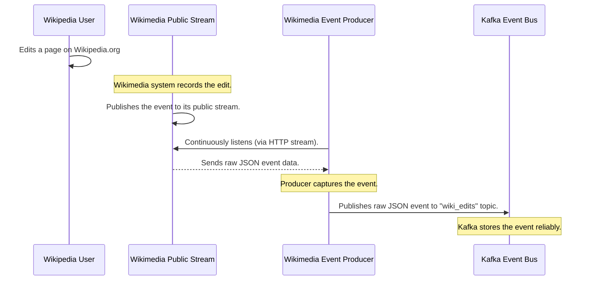

# Chapter 5: Wikimedia Event Producer

Welcome back, data detectives! In our last chapter, we discovered the incredible power of the [Kafka Event Bus](04_kafka_event_bus_.md), which acts as the super-fast data highway for all our Wikipedia events. We learned how our [Spark Real-time Data Pipeline](03_spark_real_time_data_pipeline_.md) subscribes to Kafka to get the raw data it needs for processing.

But a fundamental question still remains: Where does all this raw Wikipedia event data *originally come from*? How do those real-time edits, new pages, and log events actually *get onto* our Kafka highway in the first place?

This is where the **Wikimedia Event Producer** steps in!

## What Problem Does the Wikimedia Event Producer Solve?

Imagine you're trying to follow every single news story breaking worldwide, right as it happens. You wouldn't just sit and wait for newspapers to be printed at the end of the day, nor would you randomly check a few websites. You'd need a dedicated "news reporter" who is constantly monitoring all the major news wires, social media feeds, and breaking news channels, capturing every single piece of relevant information as it emerges.

For our project, **Wikimedia Event Producer** is exactly that dedicated "news reporter" for Wikipedia. Millions of changes happen on Wikipedia every day, from tiny typo corrections to massive page creations. If we want to analyze these changes in real-time, we need a way to:
1.  **Connect** directly to the official source of Wikimedia events.
2.  **Continuously listen** for new changes, 24/7.
3.  **Capture** every single relevant event, ensuring nothing is missed.
4.  **Forward** these raw events to our system's data highway ([Kafka Event Bus](04_kafka_event_bus_.md)) for further processing.

The Wikimedia Event Producer's job is to efficiently capture every relevant update from Wikipedia's public stream and send it to our [Kafka Event Bus](04_kafka_event_bus_.md), making sure we have a complete and up-to-the-second source of information for our analysis.

## What is the Wikimedia Event Producer?

At its core, the Wikimedia Event Producer is a program designed to be the very first point of contact for Wikipedia data in our system. It doesn't do any complex analysis or data cleaning; its single focus is on *ingestion* – bringing data *in*.

Here's how it works:
*   **Connecting to the Source:** Wikimedia (the organization behind Wikipedia) provides a public "event stream." This is like a live news ticker that continuously broadcasts every change happening across all its wikis (like English Wikipedia, German Wikipedia, Wikidata, etc.).
*   **Listening Continuously:** Our producer program establishes a connection to this stream and simply sits there, patiently listening. Every time a new edit, a new page, or any other log event occurs on Wikipedia, it gets broadcast on this stream.
*   **Capturing Raw Events:** As soon as an event appears on the stream, our producer captures it in its raw JSON (JavaScript Object Notation) format. JSON is just a common way to organize data, similar to how you might organize information in a structured list or dictionary.
*   **Publishing to Kafka:** Once captured, the producer immediately sends this raw JSON event to our [Kafka Event Bus](04_kafka_event_bus_.md). This is like the news reporter quickly sending their story to the central news agency.

Think of it as the ultimate "data collector" that ensures our project is always fed with the freshest Wikipedia updates.

## How Our Project Uses the Wikimedia Event Producer

In our project, the `wiki_producer.py` script is our Wikimedia Event Producer. It's written in Python and uses a few libraries to connect to Wikimedia and then publish to Kafka.

Let's look at the basic steps it takes.

### 1. Tuning into Wikimedia's Live News Feed

First, our producer needs to connect to the actual Wikimedia event stream. This is like tuning a radio to a specific news channel. Wikimedia provides a public URL for this stream.

```python
import requests # Used to connect to web streams
import json     # Used to work with JSON data
from kafka import KafkaProducer # Used to send data to Kafka

URL = "https://stream.wikimedia.org/v2/stream/recentchange"

headers = {
    "User-Agent": "BigData_WikipediaEditAnalysis/1.0", # Identifies our program to Wikimedia
    "Accept": "text/event-stream"
}

print("Connecting to Wikimedia's live stream...")
response = requests.get(URL, headers=headers, stream=True)
print("Connected successfully!")
```

**Explanation:**
*   `URL = "..."`: This is the special web address where Wikimedia broadcasts all its real-time changes.
*   `headers = {...}`: These are like our program's "ID card" when connecting. `User-Agent` is important to tell Wikimedia who is connecting.
*   `requests.get(URL, ..., stream=True)`: This line uses the `requests` library to open a continuous connection to the Wikimedia stream. `stream=True` means we want to keep the connection open to receive data as it comes.
*   Once `response` is received, our program is successfully "tuned in"!

### 2. Setting Up to Send Stories to Kafka

Before we start receiving news, we also set up our connection to the [Kafka Event Bus](04_kafka_event_bus_.md), ready to publish the captured events.

```python
# (Imports and URL/headers from above)

# Set up our Kafka producer (from Chapter 4)
producer = KafkaProducer(
    bootstrap_servers='localhost:9092', # The address of our Kafka server
    value_serializer=lambda v: json.dumps(v).encode('utf-8') # How to convert Python data to send
)

# ... (response = requests.get(...) from previous step) ...
```

**Explanation:**
*   `KafkaProducer(...)`: This creates an object that knows how to send messages to Kafka.
*   `bootstrap_servers='localhost:9092'`: This tells our producer where to find the Kafka "post office" (broker).
*   `value_serializer=...`: This is a small helper that converts our Python data (which is a dictionary) into a JSON string and then into bytes, which is the format Kafka expects.

### 3. Continuously Capturing and Publishing Events

Now, our producer goes into a continuous loop, listening to the Wikimedia stream, picking up events, and immediately forwarding them to Kafka.

```python
# (All setup code from above)

print("Listening for changes and sending to Kafka...")
for line in response.iter_lines(decode_unicode=True):
    if line.startswith("data: "): # Each event message from Wikimedia starts with "data: "
        try:
            event_data = json.loads(line[6:]) # Parse the JSON message (removing "data: ")
            producer.send("wiki_edits", value=event_data) # Send to our "wiki_edits" topic!

            # Print a confirmation for debugging
            print(f"Captured and sent edit for: {event_data.get('title', 'Unknown Page')}")

        except Exception as e:
            print(f"Error processing Wikimedia event: {e}")

```

**Explanation:**
*   `for line in response.iter_lines(...)`: This is the heart of the producer. It continuously reads new lines of data as they come from the Wikimedia stream.
*   `if line.startswith("data: ")`: Wikimedia events are formatted in a special way; each event message itself begins with "data: ". We only care about these lines.
*   `json.loads(line[6:])`: We remove the "data: " prefix (which is 6 characters long) and then use `json.loads` to convert the raw JSON text into a usable Python dictionary.
*   `producer.send("wiki_edits", value=event_data)`: This is the critical step! We take our `event_data` (the captured Wikipedia event) and send it to the `wiki_edits` topic on our [Kafka Event Bus](04_kafka_event_bus_.md).
*   The `try...except` block is there to catch any errors if an event message is not perfectly formed, ensuring our producer keeps running.

This loop runs indefinitely, constantly scanning for new Wikipedia changes and pushing them into our data pipeline.

## How the Wikimedia Event Producer Works Behind the Scenes

Let's visualize the journey of a single Wikipedia edit from the moment it happens to when it enters our system.



1.  **User Edits Wikipedia:** A user (or a bot) makes a change on any Wikimedia project, like editing a page on English Wikipedia.
2.  **Wikimedia Publishes:** The Wikimedia infrastructure immediately detects this change and publishes it as an "event" to its public event stream. This stream is designed to allow external applications like ours to see these changes in real-time.
3.  **Producer Listens:** Our `wiki_producer.py` script is actively connected to this public stream, continuously listening for any new messages.
4.  **Producer Captures Event:** As soon as the Wikimedia stream broadcasts the new edit event, our producer receives the raw JSON data containing all the details about that edit (what page, who edited it, what type of change, etc.).
5.  **Producer Publishes to Kafka:** The producer quickly takes this raw JSON event and sends it to the `wiki_edits` topic on our [Kafka Event Bus](04_kafka_event_bus_.md).
6.  **Kafka Stores:** Kafka receives the event and stores it reliably, making it available for our [Spark Real-time Data Pipeline](03_spark_real_time_data_pipeline_.md) (and other consumers) to read and process.

This entire process happens within milliseconds for every single event, ensuring our system has the most up-to-date view of Wikipedia activity.

## Why the Wikimedia Event Producer is Essential

| Feature            | Benefit for `BigData_WikipediaEditAnalysis`                                                                                                                              |
| :----------------- | :----------------------------------------------------------------------------------------------------------------------------------------------------------------------- |
| **Real-time Source** | It's the only component that directly connects to the live Wikimedia stream, providing us with events as they happen, enabling real-time analytics.                     |
| **Data Ingestion** | Serves as the crucial gateway for *all* Wikipedia event data into our project, without which our system would have no data to analyze.                                   |
| **Completeness**   | By continuously listening to the official stream, it aims to capture every single public Wikimedia change, ensuring no valuable data is missed.                            |
| **Decoupling**     | It focuses solely on capturing and forwarding. It doesn't need to know *what* happens to the data next, just that it sends it reliably to [Kafka Event Bus](04_kafka_event_bus_.md). |
| **Simplicity**     | Its dedicated role keeps it simple and robust, making it efficient at its specific task of feeding our pipeline.                                                         |

## Conclusion

The Wikimedia Event Producer is the dedicated "ear" and "voice" of our `BigData_WikipediaEditAnalysis` project. It tirelessly monitors the vast and constantly changing world of Wikipedia, capturing every edit, new page, and log event directly from the source. By efficiently publishing these raw events to the [Kafka Event Bus](04_kafka_event_bus_.md), it ensures our entire system is continuously fed with the freshest data, making all subsequent real-time and batch analytics possible. It's the essential first step in bringing the dynamic world of Wikipedia into our analytical framework.

Now that we understand how data is captured in real-time and flows through our system, we'll shift our focus from real-time processing to how we can analyze historical data and generate deeper insights. That's what we'll explore in the very next chapter!

[Next Chapter: Spark Batch Analytics Engine](06_spark_batch_analytics_engine_.md)

---

<sub><sup>**References**: [[1]](https://github.com/ISRajesh183/BigData_WikipediaEditAnalysis/blob/e2ede20441ea8af415eea2e95e9729fddc5403bc/wiki_producer.py)</sup></sub>
