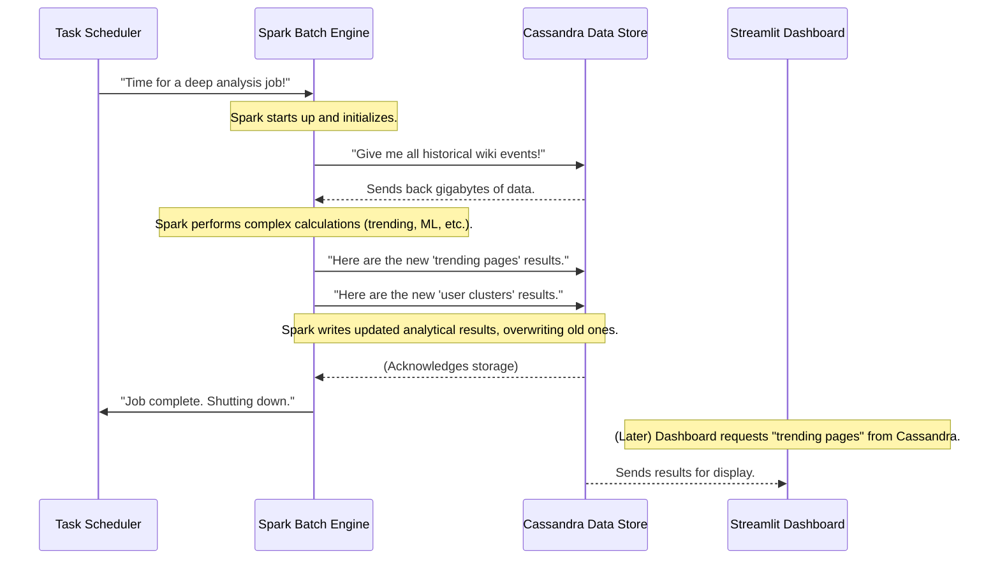

# Chapter 6: Spark Batch Analytics Engine

Welcome back, data explorers! In our last chapter, we looked at the [Wikimedia Event Producer](05_wikimedia_event_producer_.md), the tireless reporter that feeds us raw Wikipedia changes onto the [Kafka Event Bus](04_kafka_event_bus_.md). We then saw how our [Spark Real-time Data Pipeline](03_spark_real_time_data_pipeline_.md) processes these events as they happen, storing them in the [Cassandra Data Store](02_cassandra_data_store_.md).

But imagine this: real-time analysis is great for "what's happening *now*," like seeing your car's current speed. What if you want to understand deeper things, like:
*   Which users consistently make big changes over weeks?
*   Are there long-term trends in edits to specific topics?
*   Can we group users based on their editing style?
*   Are there any historical patterns that indicate unusual activity, not just sudden spikes?

These questions require looking at *lots* of historical data, not just the latest events. This is where the **Spark Batch Analytics Engine** comes in!

## What Problem Does the Spark Batch Analytics Engine Solve?

Think of our project having two types of data scientists:

1.  **The "Live Reporter" (Real-time Pipeline):** This one quickly processes every new event as it arrives, giving us immediate updates (like how many edits happened in the last minute).
2.  **The "Deep Researcher" (Batch Analytics Engine):** This one doesn't rush. Instead, it regularly (maybe once an hour, once a day, or even once a week) goes through all the historical data collected over time. It performs complex calculations, finds hidden patterns, runs experiments, and even uses machine learning.

The **Spark Batch Analytics Engine** is our "Deep Researcher." It solves the problem of needing **deeper, more complex insights** that can't be computed in real-time. It takes the vast amount of historical Wikipedia edit data stored in our [Cassandra Data Store](02_cassandra_data_store_.md) and turns it into valuable knowledge, like identifying user groups, uncovering long-term trends, or detecting subtle anomalies. The results of these deep dives are then saved back into [Cassandra Data Store](02_cassandra_data_store_.md) for the [Streamlit Analytics Dashboard](01_streamlit_analytics_dashboard_.md) to display.

## What is "Batch Analytics"?

"Batch analytics" means processing data in **batches**, rather than continuously. Imagine baking:
*   **Real-time** is like having a constantly running conveyor belt that cooks one cookie at a time as soon as the dough is placed.
*   **Batch** is like waiting until you have enough dough to fill an entire oven, then baking all the cookies at once. It might take longer for the whole batch, but it's very efficient for large quantities and allows for more complex recipes (analyses).

For our Wikipedia project, the Spark Batch Analytics Engine wakes up, loads a big "batch" of historical Wikipedia events (from minutes ago to days ago), crunches the numbers, generates reports, and then goes back to "sleep" until its next scheduled run.

## How Our Project Uses the Spark Batch Analytics Engine

Our project's Spark Batch Analytics Engine is primarily implemented in the `wiki_analytics.py` script. It uses Apache Spark to perform sophisticated analyses on the data that has accumulated in [Cassandra Data Store](02_cassandra_data_store_.md).

Let's walk through its main steps:

### 1. Starting Spark and Connecting to Data

First, our batch engine needs to start its Spark "brain" and tell it where to find the historical data in [Cassandra Data Store](02_cassandra_data_store_.md).

```python
from pyspark.sql import SparkSession
from pyspark.sql.functions import *
# ... other imports ...

# 1. Start our Spark processing engine for batch jobs
spark = SparkSession.builder \
    .appName("WikiFullAnalytics") \
    .config("spark.cassandra.connection.host", "127.0.0.1") \
    .getOrCreate()

# 2. Load historical data from Cassandra
events_base = spark.read \
    .format("org.apache.spark.sql.cassandra") \
    .options(table="events_base", keyspace="wiki") \
    .load()

# Load edit-specific events for deeper analysis
events_edit = spark.read \
    .format("org.apache.spark.sql.cassandra") \
    .options(table="events_edit", keyspace="wiki") \
    .load()
```

**Explanation:**
*   `SparkSession.builder...`: This line initializes Spark. We give it a name (`"WikiFullAnalytics"`) and tell it how to connect to our [Cassandra Data Store](02_cassandra_data_store_.md). `127.0.0.1` is used here because, within the Docker network, Spark's container can see Cassandra's container at this address.
*   `spark.read.format("org.apache.spark.sql.cassandra")...load()`: This is how Spark fetches *all* the historical data from specific tables in our `wiki` keyspace in [Cassandra Data Store](02_cassandra_data_store_.md). We load `events_base` (general event info) and `events_edit` (details about actual edits). Unlike the real-time pipeline, which `readStream`s new data, here we just `read` all available data.

### 2. Performing Deep Analyses (Examples)

Now that Spark has all the historical data, it can run complex calculations. Here are a few examples from `wiki_analytics.py`:

#### A. Identifying Trending Pages Over Time

Instead of just recent spikes, we can find pages that are consistently edited a lot within specific time windows, over a longer period.

```python
# From wiki_analytics.py

# Group by page title and 10-minute intervals, then count edits
trending = events_base.groupBy(
    "title",
    window("event_time", "10 minutes")
).agg(count("*").alias("edit_count")) \
 .filter("edit_count > 5") \
 .select(
    col("title"),
    col("window.start").alias("window_start"),
    col("edit_count")
)
```

**Explanation:**
*   `groupBy("title", window("event_time", "10 minutes"))`: This is a powerful Spark feature! It groups all events for the same `title` and for every `10-minute` block of time they occurred in.
*   `.agg(count("*").alias("edit_count"))`: For each of these title-time blocks, we count how many edits there were.
*   `.filter("edit_count > 5")`: We only consider pages that had more than 5 edits in any 10-minute window to be "trending."
*   **Output:** A table showing specific pages, the start of the 10-minute window, and how many edits they received in that window (e.g., "enwiki" "Main Page" on 2023-10-26 14:00:00 had 12 edits).

#### B. Detecting Anomalies (Unusually Large Edits)

We can look for edits that are statistically very different from the average, possibly indicating spam or unusual activity.

```python
# From wiki_analytics.py (simplified)

# Calculate the mean and standard deviation of edit size differences
# (size_diff is the change in page length from a previous step)
stats = events_edit.select(
    mean("size_diff").alias("mean"),
    stddev("size_diff").alias("std")
).collect()[0]

# Calculate a Z-score for each edit to see how 'unusual' it is
anomalies = events_edit.withColumn(
    "z_score",
    (col("size_diff") - lit(stats["mean"])) / lit(stats["std"])
).filter(col("z_score") > 3) \
 .select("wiki", "event_time", "title", "user", "z_score")
```

**Explanation:**
*   `mean("size_diff")` and `stddev("size_diff")`: Spark calculates the average and spread (standard deviation) of all edit size changes.
*   `withColumn("z_score", ...)`: For each edit, we calculate its "Z-score." A high Z-score means the edit's size change is very far from the average.
*   `.filter(col("z_score") > 3)`: We consider edits with a Z-score greater than 3 to be "anomalies" – they are much larger than typical edits.
*   **Output:** A table listing potentially suspicious edits, their associated wiki, timestamp, title, user, and their calculated Z-score.

#### C. User Clustering with Machine Learning

We can use machine learning to group users with similar editing patterns. Here, we'll simplify and cluster users based on their average edit size.

```python
# From wiki_analytics.py (simplified)
from pyspark.ml.feature import VectorAssembler
from pyspark.ml.clustering import KMeans

# 1. Prepare user data: calculate average edit size for each user
user_features = events_edit.groupBy("user").agg(
    avg("size_diff").alias("avg_diff")
).na.fill(0)

# 2. Convert features into a format KMeans can use
assembler = VectorAssembler(inputCols=["avg_diff"], outputCol="features")
data = assembler.transform(user_features)

# 3. Run KMeans to group users into 2 clusters
kmeans = KMeans(k=2, seed=1) # k=2 means we want 2 groups
model = kmeans.fit(data)

# 4. Assign each user to a cluster
clusters = model.transform(data) \
    .select("user", col("prediction").alias("cluster"))
```

**Explanation:**
*   `user_features = ...`: We first create a table where each row is a `user` and a column for their `avg_diff` (average size change of their edits).
*   `VectorAssembler`: This is a Spark ML tool that takes numerical columns and combines them into a single "features" vector, which is what machine learning algorithms usually expect.
*   `KMeans(k=2)`: `KMeans` is a common clustering algorithm. We tell it to find `2` distinct groups (`k=2`) of users.
*   `model = kmeans.fit(data)`: Spark learns the patterns to create these 2 groups from our data.
*   `clusters = model.transform(data)`: It then assigns each `user` to one of the `2` clusters (0 or 1).
*   **Output:** A table showing each `user` and the `cluster` (e.g., "0" or "1") they belong to, based on their average edit size. This can help identify different types of contributors (e.g., users who make many small edits vs. users who make fewer, larger edits).

### 3. Saving Results Back to Cassandra

After all these complex calculations, the results (like trending pages, anomalies, or user clusters) need to be stored so the [Streamlit Analytics Dashboard](01_streamlit_analytics_dashboard_.md) can display them.

```python
# From wiki_analytics.py (simplified)

# Helper function to write any DataFrame to Cassandra
def write(df, table, mode="overwrite"): # Batch jobs often overwrite previous results
    df.write \
        .format("org.apache.spark.sql.cassandra") \
        .options(table=table, keyspace="wiki") \
        .mode(mode) \
        .save()

# Write the calculated results to Cassandra tables
write(trending, "analytics_trending", "overwrite")
write(anomalies, "analytics_anomalies", "append") # Append for new anomalies
write(clusters, "analytics_user_clusters", "overwrite") # Overwrite user clusters

print("✅ FULL ANALYTICS PIPELINE COMPLETED")

spark.stop() # Stop the Spark engine after the batch job is done
```

**Explanation:**
*   `write(df, table, mode="overwrite")`: This helper function (defined in `wiki_analytics.py`) takes a Spark DataFrame (like `trending` or `clusters`), connects to our `wiki` keyspace in [Cassandra Data Store](02_cassandra_data_store_.md), and saves the results to the specified `table` (e.g., `analytics_trending`).
*   `mode="overwrite"`: For many batch analytics, we replace the previous results with the newly calculated ones. For anomalies, we might `append` new detections.
*   `spark.stop()`: After all analyses are done and results are saved, the Spark engine is shut down until the next scheduled run. This saves computing resources.

## How the Spark Batch Analytics Engine Works Behind the Scenes

Let's see the journey of data through our batch processing:



1.  **Scheduled Trigger:** A scheduling tool (like `cron` on Linux, or a dedicated orchestrator) periodically tells our `wiki_analytics.py` script to start.
2.  **Spark Starts Up:** The script launches the Spark Batch Engine.
3.  **Loads Historical Data:** Spark connects to the [Cassandra Data Store](02_cassandra_data_store_.md) and reads all the relevant historical data (all `events_base` and `events_edit` from the past hour, day, week, etc.).
4.  **Deep Analysis:** Spark then uses its powerful processing capabilities to run all the defined analytics: calculating trends, detecting anomalies, running machine learning models for user clustering, and more. This might take several minutes or even longer, depending on the data volume.
5.  **Writes Results:** Once the calculations are complete, Spark writes the new analytical results back into specific tables in the [Cassandra Data Store](02_cassandra_data_store_.md), typically overwriting the previous batch's results.
6.  **Spark Shuts Down:** The Spark engine then stops, freeing up resources until its next scheduled run.
7.  **Dashboard Displays:** Later, when a user opens the [Streamlit Analytics Dashboard](01_streamlit_analytics_dashboard_.md), it queries [Cassandra Data Store](02_cassandra_data_store_.md) to fetch these *pre-calculated* batch results and displays them as charts and metrics.

## Why the Spark Batch Analytics Engine is Essential

| Feature              | Benefit for `BigData_WikipediaEditAnalysis`                                                                  |
| :------------------- | :----------------------------------------------------------------------------------------------------------- |
| **Deeper Insights**  | Uncovers complex patterns, trends, and relationships that real-time analysis can't capture.                  |
| **Historical Context** | Provides a long-term view of Wikipedia activity, allowing us to see evolution and sustained behavior.          |
| **Machine Learning** | Enables the use of sophisticated ML models (like clustering) that require processing large datasets.           |
| **Resource Efficiency** | Runs periodically and then shuts down, saving computing resources compared to always-on real-time processes. |
| **Scalability**      | Uses Apache Spark, which can easily scale to handle massive volumes of historical data by adding more machines. |
| **Value Generation** | Transforms raw historical data into actionable intelligence for the dashboard.                                 |

## Conclusion

The Spark Batch Analytics Engine is the "brain" behind our project's deeper understanding of Wikipedia edits. It regularly performs comprehensive analyses on vast amounts of historical data from the [Cassandra Data Store](02_cassandra_data_store_.md), going beyond immediate events to reveal long-term trends, sophisticated anomalies, and user behaviors through techniques like machine learning. By saving these rich insights back into Cassandra, it ensures our [Streamlit Analytics Dashboard](01_streamlit_analytics_dashboard_.md) can provide a complete and intelligent picture of the dynamic world of Wikipedia.

This concludes our journey through the core components of the `BigData_WikipediaEditAnalysis` project! You now understand how events are produced, flow through Kafka, are processed in real-time, stored in Cassandra, analyzed in batches, and finally displayed on a dashboard.

---

<sub><sup>**References**: [[1]](https://github.com/ISRajesh183/BigData_WikipediaEditAnalysis/blob/e2ede20441ea8af415eea2e95e9729fddc5403bc/wiki_analytics.py)</sup></sub>
